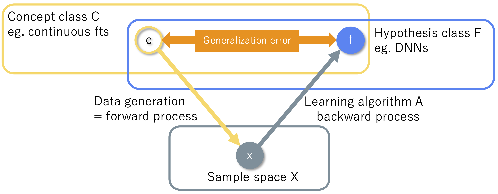

<!-- # lean-rademacher ITP 2026 slide outline

An English draft for reviewing the flow of the presentation.
Each `---` is intended to delimit one slide; no design changes are specified here.

Sources:

- The `ss` branch of `lean-rademacher`, commit `34c42b4`
- `lean-rademacher/note/summary.md` (updated 24 July 2026)
- The ITP 2026 paper
- The audience is not assumed to be familiar with statistical learning theory -->

<!-- _class: title -->

### Lean-Rademacher
## Lean Formalization of Generalization Error Bounds by Rademacher Complexity and Dudley's Entropy Integral

Sho Sonoda, Kazumi Kasaura, Yuma Mizuno, Kei Tsukamoto, Naoto Onda

**ITP 2026@Lisbon, Portugal, 26-29 July 2026**

Presenter: Sho Sonoda (RIKEN AIP / CyberAgent Inc)

---

## Motivation

As machine-learning research grows, trustworthy AI assistance for theoretical work requires **machine-checkable foundations**.


<small>Source: [Paper Copilot, “NeurIPS Statistics” as of July 2026](https://papercopilot.com/statistics/neurips-statistics/).</small>

---

## General formulation of statistical machine learning:

**Machine learning selects a hypothesis from a finite sample**

- We receive a **finite** training data $S=(z_1,\ldots,z_n)$ from an unknown distribution $\mu$.
- A learning algorithm $A$ selects **hypothesis** $\widehat f=A(S)$ from a function class $\mathcal F$.
- What we really want to know is its **generalization performance** on **test data** $Z\sim\mu$,
  rather than its performance on the training sample $S$.
- But this is not directly observable, we refer to a **generalization error bound** as a probabilistic guarantee from the finite sample.



---

## What this study formalizes

- the basic generalization bound using Rademacher complexity,
- applications to regularized linear models,
- an extension via Dudley's entropy integral.

---

<!-- _class: title -->

# Generalization from finite samples

---

## Generalization gap and excess risk arise together

Let **hypothesis** $f(x,y)=\ell(g(x),y)$ denote **predictor** $g$ followed by **loss function** $\ell$. Define the **empirical risk** and **population risk** as below.
$$
\widehat L_S(f):=\frac1n\sum_{k=1}^n f(z_k),
\qquad
L(f):=\mathbb E[f(Z)].
$$

While **training error** $\widehat L_S(\widehat f)$ is observable, we want to know **test error** $L(\widehat f)$.

If $\widehat f$ is an $\eta$-approximate empiricak risk minimizer (ERM) and $f^\star$ is any comparator, then

$$
\begin{aligned}
\underbrace{L(\widehat f)-L(f^\star)}_{\text{excess risk}}
=
\underbrace{L(\widehat f)-\widehat L_S(\widehat f)}
_{\text{generalization gap at $\widehat f$}}
+
\underbrace{\widehat L_S(\widehat f)-\widehat L_S(f^\star)}
_{\text{optimization error }\le\eta}
+
\underbrace{\widehat L_S(f^\star)-L(f^\star)}
_{\text{generalization gap at $f^\star$}}.
\end{aligned}
$$

Thus, **excess risk** is controlled once the **uniform deviation** $\sup_{f \in \mathcal F} |\widehat L_S(f) - L(f) |$ is controlled. We therefore use uniform deviation as the main object in this talk.

---

## Uniform deviation handles a data-dependent hypothesis

<!-- For a fixed $f$, the law of large numbers controls its generalization gap.
It cannot be applied directly to $\widehat f=A(S)$, which depends on the sample.
Instead, define -->
Define the **uniform deviation**

$$
\Delta_n(S):=
\sup_{f\in\mathcal F}
\left|\widehat L_S(f)-L(f)\right|.
$$

The decomposition on the previous slide immediately gives

$$
L(\widehat f)-L(f^\star)\le 2\Delta_n(S)+\eta.
$$

The same objects are represented directly in Lean:

```lean
def riskDeviation
    [MeasurableSpace Ω]
    (n : ℕ) (ℓ : H → 𝒵 → ℝ) (μ : Measure Ω) (Z : Ω → 𝒵) (S : Fin n → 𝒵) (h : H) : ℝ :=
  |empiricalRisk n ℓ S h - populationRisk ℓ μ Z h|

def uniformDeviation
    (n : ℕ) (f : H → 𝒵 → ℝ) (μ : Measure Ω)
    (Z : Ω → 𝒵) (S : Fin n → 𝒵) : ℝ :=
  ⨆ h, |(n : ℝ)⁻¹ * ∑ k : Fin n, f h (S k) -
    μ[fun ω' ↦ f h (Z ω')]|
```

---

## The oracle inequality in Lean mirrors the decomposition

Mathematically, approximate ERM means
$\widehat L_S(\widehat f)\le\widehat L_S(f)+\eta$ for every $f\in\mathcal F$.

```lean
def IsApproxERM
    (η : ℝ) (n : ℕ) (ℓ : H → 𝒵 → ℝ)
    (S : Fin n → 𝒵) (hhat : H) : Prop :=
  ∀ h, empiricalRisk n ℓ S hhat ≤
    empiricalRisk n ℓ S h + η

theorem IsApproxERM.excessRisk_le_two_mul_uniformDeviation
    {hhat hstar : H} {η : ℝ}
    (hERM : IsApproxERM η n ℓ S hhat)
    (hbounded : BddAbove
      (Set.range fun h ↦ riskDeviation n ℓ μ Z S h)) :
    excessRisk ℓ μ Z hhat hstar ≤
      2 * uniformDeviation n ℓ μ Z S + η
```

Here `hhat hstar : H` represent $\widehat f,f^\star\in\mathcal F$.
No population-risk minimizer is required; any comparator can be used.

---

<!-- _class: title -->

# Rademacher complexity and the main theorem

---

## Intuition behind Rademacher complexity

Fix a sample $S=(z_1,\ldots,z_n)$ and assign a random sign $\sigma_k\in\{-1,+1\}$ to each point.

$$
Q(f,\sigma_{1:n},S) := 
\frac1n\sum_{k=1}^n \sigma_k f(z_k)
$$

We then search for an $f\in\mathcal F$ that makes this quantity $Q$ large.

- Small: the class $\mathcal F$ cannot easily fit random noise.
- Large: the class $\mathcal F$ can express many patterns and is more prone to overfitting.

So, it measures the freedom to select $f$ after observing the sample.

---

## Rademacher complexity

Given a sample $S$ and random signs $\sigma_k \in \{-1,+1\}$, set

the empirical (absolute) Rademacher complexity
$$
\widehat{\mathfrak R}_n(\mathcal F;S)
:=
\mathbb E_\sigma
\left[
\sup_{f\in\mathcal F}
\left|
\frac1n\sum_{k=1}^n
\sigma_k f(z_k)
\right|
\right],
$$

the empirical one-sided Rademacher complexity
$$
\widehat{\mathfrak R}^{\mathrm{one}}_n(\mathcal F;S)
:=
\mathbb E_\sigma
\left[
\sup_{f\in\mathcal F}
\frac1n\sum_{k=1}^n\sigma_k f(z_k)
\right],
$$

and  the expected (absolute) Rademacher complexity
$$
\mathfrak R_n(\mathcal F)
:=\mathbb E_S[\widehat{\mathfrak R}_n(\mathcal F;S)].
$$

---

## Lean: Rademacher complexities and uniform deviation

The mathematical objects
$\widehat{\mathfrak R}_n$, $\mathfrak R_n$, and $\Delta_n$
are kept together in the same Lean API:

```lean
def Signs (n : ℕ) : Type := Fin n → ({-1, 1} : Finset ℤ)

def empiricalRademacherComplexity
    (n : ℕ) (f : H → 𝒳 → ℝ) (S : Fin n → 𝒳) : ℝ :=
  (Fintype.card (Signs n) : ℝ)⁻¹ *
    ∑ σ : Signs n, ⨆ i, |(n : ℝ)⁻¹ * ∑ k : Fin n, (σ k : ℝ) * f i (S k)|

def empiricalRademacherComplexity_without_abs
    (n : ℕ) (f : H → 𝒳 → ℝ) (S : Fin n → 𝒳) : ℝ :=
  (Fintype.card (Signs n) : ℝ)⁻¹ *
    ∑ σ : Signs n, ⨆ i, (n : ℝ)⁻¹ * ∑ k : Fin n, (σ k : ℝ) * f i (S k)

def rademacherComplexity
    (n : ℕ) (f : H → 𝒳 → ℝ) (μ : Measure Ω) (X : Ω → 𝒳) : ℝ :=
  μⁿ[fun ω : Fin n → Ω ↦ empiricalRademacherComplexity n f (X ∘ ω)]

def uniformDeviation
    (n : ℕ) (f : H → 𝒳 → ℝ) (μ : Measure Ω) (X : Ω → 𝒳) (S : Fin n → 𝒳) : ℝ :=
  ⨆ i, |(n : ℝ)⁻¹ * ∑ k : Fin n, f i (S k) - μ[fun ω' ↦ f i (X ω')]|
```

`f : H → 𝒳 → ℝ` enumerates $\mathcal F$, and each `h : H` corresponds to a function $f_h\in\mathcal F$.

---

## Main theorem: Rademacher generalization bound

> **Theorem (basic Rademacher generalization bound)**
> 
> Assume that the function class $\mathcal F$ satisfies $|f(z)|\le b$ for every $f\in\mathcal F$ and $z\in\mathcal Z$.
> 
> Under suitable measurability, separability, and continuity assumptions,
>
> $$
> \mathbb E_S[\Delta_n(S)]
> \le 2\mathfrak R_n(\mathcal F),
> $$
>
> $$
> \Pr\left\{
> \Delta_n(S)
> \ge 2\mathfrak R_n(\mathcal F)+\varepsilon
> \right\}
> \le
> \exp\left(-\frac{n\varepsilon^2}{2b^2}\right),
> $$
>
> $$
> \Pr\left\{
> \Delta_n(S)
> \ge
> 2\widehat{\mathfrak R}_n(\mathcal F;S)+3\varepsilon\right\}
> \le
> 2\exp\left(-\frac{n\varepsilon^2}{2b^2}\right).
> $$

Setting $\varepsilon=b\sqrt{2\log(1/\delta)/n}$ shows that, with probability at least $1-\delta$ (resp. $1-2\delta$),
$$\Delta_n(S)<2\mathfrak R_n(\mathcal F)+\varepsilon,
\quad
\Delta_n(S)<2\widehat{\mathfrak R}_n(\mathcal F;S)+3\varepsilon.$$


---

## Lean: the main theorem for a separable class

The tail bound
$\Pr\{\Delta_n\ge2\mathfrak R_n+\varepsilon\}
\le\exp(-n\varepsilon^2/(2b^2))$
is stated directly as:

```lean
theorem uniform_deviation_tail_bound_separable_of_pos
    [MeasurableSpace 𝒳] [Nonempty 𝒳] [Nonempty H]
    [TopologicalSpace H] [SeparableSpace H] [FirstCountableTopology H]
    [IsProbabilityMeasure μ]
    (F : H → 𝒳 → ℝ) (hF_meas : ∀ h, Measurable (F h))
    (X : Ω → 𝒳) (hX : Measurable X)
    {b : ℝ} (hb : 0 < b)
    (hF_bound : ∀ h x, |F h x| ≤ b)
    (hF_cont : ∀ x : 𝒳, Continuous fun h ↦ F h x)
    {ε : ℝ} (hε : 0 ≤ ε) :
    (μⁿ {S |
      2 * rademacherComplexity n F μ X + ε ≤
        uniformDeviation n F μ X (X ∘ S)}).toReal ≤
      (-ε ^ 2 * n / (2 * b ^ 2)).exp
```

The mathematical class $\mathcal F$ is represented by a family `F` indexed by `H`; measurability, uniform boundedness, and continuity in the index are explicit in the type.

---

<!-- _class: title -->

# Proof strategy and formalization

---

## Proof sketch 1: symmetrization

> **Theorem (expected uniform deviation)**
>
> Introduce an independent ghost sample $S'=(Z'_1,\ldots,Z'_n)$. Then
>
> $$
> \begin{aligned}
> \mathbb E_S[\Delta_n(S)]
> &\le
> \mathbb E_{S,S'}\sup_{f\in\mathcal F}
> \left|\frac1n\sum_k(f(Z_k)-f(Z'_k))\right| \\
> &=
> \mathbb E_{S,S',\sigma}\sup_{f\in\mathcal F}
> \left|\frac1n\sum_k\sigma_k(f(Z_k)-f(Z'_k))\right| \\
> &\le 2\mathfrak R_n(\mathcal F).
> \end{aligned}
> $$

In Lean, we compose the product measure for the ghost sample,
invariance of the integral under sign flips, and the triangle inequality
for the supremum.

---

## Lean: from symmetrization to the expectation bound

This is the Lean endpoint of the preceding calculation
$\mathbb E[\Delta_n]\le2\mathfrak R_n$:

```lean
theorem
    uniform_deviation_expectation_le_two_smul_rademacher_complexity
    [Nonempty H] [Countable H] [IsProbabilityMeasure μ]
    (hn : 0 < n) (X : Ω → 𝒳)
    (hf : ∀ i, Measurable (f i ∘ X))
    {b : ℝ} (hb : 0 ≤ b)
    (hf' : ∀ i x, |f i x| ≤ b) :
    μⁿ[fun ω : Fin n → Ω ↦ uniformDeviation n f μ X (X ∘ ω)] ≤
      2 * rademacherComplexity n f μ X
```

We first prove this form, where `Countable H` ensures measurability of the supremum, and later lift it to separable classes.

---

## Proof sketch 2: McDiarmid's inequality

> **Theorem (McDiarmid's inequality)**
>
> Let $Z_1,\ldots,Z_n$ be independent random variables. Suppose that replacing
> only the $k$-th coordinate of the input to $\phi$ changes its value by at
> most $c_k$:
> $$
> |\phi(z_1,\ldots,z_n)-\phi(z_1,\ldots,z'_k,\ldots,z_n)|\le c_k.
> $$
> Then 
> $$
> \Pr\left\{
> \phi(Z_1,\ldots,Z_n)-\mathbb E[\phi(Z_1,\ldots,Z_n)]
> \ge\varepsilon\right\}
> \le
> \exp\left(-\frac{2\varepsilon^2}{\sum_{k=1}^n c_k^2}\right).
> $$


> **Lemma (sensitivity to replacing one coordinate)**
>
> If $|f(z)|\le b$, then $\left|\Delta_n(S)-\Delta_n(S^{(z_k\leftarrow z'_k)})\right|
> \le 2b/n$.

<!-- > **Theorem (McDiarmid's inequality for $\Delta_n$)**
> 
> $$
> \Pr\left\{
> \Delta_n-\mathbb E[\Delta_n]\ge\varepsilon\right\}
> \le
> \exp\left(-\frac{n\varepsilon^2}{2b^2}\right).
> $$ -->

Combining this concentration bound with the expectation bound proves the main theorem.

<!-- Lean represents a one-coordinate replacement as `Function.update S i x'` and passes the sensitivity estimate directly to the product-measure version of McDiarmid's inequality. -->

---

## Lean: the bounded-difference property of uniform deviation

The mathematical sensitivity estimate
$|\Delta_n(S)-\Delta_n(S^{(k)})|\le2b/n$
uses `Function.update` in Lean:

```lean
theorem uniformDeviation_bounded_difference
    [Nonempty H] [IsProbabilityMeasure μ]
    (hn : 0 < n) (X : Ω → 𝒳)
    (hf : ∀ i, Measurable (f i ∘ X))
    {b : ℝ} (hf' : ∀ i z, |f i z| ≤ b)
    (i : Fin n) (S : Fin n → 𝒳) (x' : 𝒳) :
    |uniformDeviation n f μ X S - 
      uniformDeviation n f μ X Function.update S i x')| ≤
      (n : ℝ)⁻¹ * 2 * b
```

Using `Function.update` to express two samples that differ in one coordinate makes the conclusion match the bounded-difference hypothesis of McDiarmid's inequality.

---

## Connecting empirical and expected Rademacher complexities

<!-- $\mathfrak R_n(\mathcal F)$ depends on the distribution and is not directly observable,
whereas $\widehat{\mathfrak R}_n(\mathcal F;S)$ can be computed from the training sample. -->

The empirical Rademacher complexity also changes by at most $2b/n$ when one element is replaced. Combining its lower-tail bound with the main theorem by a union bound gives

$$
\Pr\left\{
\Delta_n(S)
\ge
2\widehat{\mathfrak R}_n(\mathcal F;S)+3\varepsilon
\right\}
\le
2\exp\left(-\frac{n\varepsilon^2}{2b^2}\right).
$$

This connects empirical and expected Rademacher complexities.


---

## Making an uncountable supremum measurable

The supremum of countably-many measurable functions is measurable.
In contrast, a supremum over an uncountable class $\mathcal F$ need not be measurable.
Our formalization identifies conditions that ensure measurability.

> **Lemma (supremum over a countable dense sequence)**
>
> Let $g:H\to\mathbb R$ be continuous on a nonempty separable parameter space
> $H$, and let $(h_m)_{m\in\mathbb N}$ be a countable dense sequence. Then
>
> $$
> \sup_{h\in H}g(h)
> =
> \sup_{m\in\mathbb N}g(h_m).
> $$

In applications, continuity of the evaluation map
$h\mapsto F(h,x)$ for each $x$ implies the required continuity of $g$.

---

## Lean: moving the supremum to `denseSeq`

The mathematical equality
$\sup_{h\in H}g(h)=\sup_{m\in\mathbb N}g(h_m)$
becomes a reusable Lean lemma:

```lean
def denseSeq
    [TopologicalSpace H] [SeparableSpace H] [Nonempty H] : ℕ → H :=
  Classical.choose (exists_dense_seq H)

theorem denseRange_denseSeq
    [TopologicalSpace H] [SeparableSpace H] [Nonempty H] :
    DenseRange (denseSeq H)

noncomputable abbrev denseRestriction
    [TopologicalSpace H] [SeparableSpace H] [Nonempty H]
    (F : H → α) : ℕ → α :=
  F ∘ denseSeq H

theorem separableSpaceSup_eq_real
    [TopologicalSpace H] [SeparableSpace H] [Nonempty H]
    {g : H → ℝ} (hg : Continuous g) :
    ⨆ h : H, g h = ⨆ m : ℕ, g (denseSeq H m)
```

`denseSeq` is a proof device, not a computational procedure. Continuity then
shows that empirical complexity, expected complexity, and uniform deviation
are unchanged by the restriction.

---

<!-- _class: title -->

# Applications

---

## Application template: from a samplewise bound to generalization

The user only needs to prove a samplewise bound

$$
\widehat{\mathfrak R}_n(\mathcal F;S)\le C(S).
$$

The following basic generalization theorem handles the model-independent
probabilistic part.

> **Theorem (generalization from a sample-dependent bound)**
>
> If $|f(z)|\le b$ and the samplewise bound above holds, then
>
> $$
> \Pr\left\{
> \Delta_n(S)
> \ge
> 2C(S)
> +3b\sqrt{\frac{2\log(2/\delta)}{n}}
> \right\}
> \le\delta.
> $$

---

## Lean: the basic theorem accepting a sample-dependent bound

The theorem below packages the implication
$\widehat{\mathfrak R}_n(\mathcal F;S)\le C(S)
\Longrightarrow \Delta_n(S)\lesssim2C(S)+O(n^{-1/2})$.

```lean
theorem
    uniform_deviation_tail_bound_separable_of_sample_empirical_le_delta
    [MeasurableSpace 𝒳] [Nonempty 𝒳] [Nonempty H]
    [TopologicalSpace H] [SeparableSpace H] [FirstCountableTopology H]
    [IsProbabilityMeasure μ]
    (hn : 0 < n)
    (F : H → 𝒳 → ℝ) (hF_meas : ∀ h, Measurable (F h))
    (X : Ω → 𝒳) (hX : Measurable X)
    (C : (Fin n → 𝒳) → ℝ)
    {b δ : ℝ} (hb : 0 < b)
    (hF_bound : ∀ h x, |F h x| ≤ b)
    (hF_cont : ∀ x, Continuous fun h ↦ F h x)
    (hC : ∀ S, empiricalRademacherComplexity n F S ≤ C S)
    (hδ : 0 < δ) (hδ_one : δ ≤ 1) :
    (μⁿ {S | 2 * C (X ∘ S) + 3 * (b * Real.sqrt (2 * Real.log (2 / δ) / n)) ≤
      uniformDeviation n F μ X (X ∘ S)}).toReal ≤ δ
```

Only `hC` is model-specific; the theorem handles all remaining concentration arguments uniformly.

<!-- Application workflow:

$$
\text{Define the function class}
\to
\widehat{\mathfrak R}_n\le C(S)
\to
\text{Basic generalization theorem}
\to
\text{Generalization and excess risk}
$$ -->

---

## Example 1: $\ell_2$-constrained linear predictors

$$
f_w(x)=\langle w,x\rangle,
\qquad
\|w\|_2\le W.
$$

> **Theorem (empirical complexity of $\ell_2$ linear predictors)**
>
> For a fixed sample $S=(x_1,\ldots,x_n)$,
>
> $$
> \widehat{\mathfrak R}_n(\mathcal F;S)
> \le
> \frac{W}{n}
> \sqrt{\sum_{k=1}^n\|x_k\|_2^2}.
> $$

The proof uses Cauchy--Schwarz to eliminate the supremum over weights
and orthogonality of the Rademacher signs to eliminate off-diagonal terms.

<!-- $$
\mathbb E_\sigma
\left\|\sum_k\sigma_kx_k\right\|
\le
\sqrt{\sum_k\|x_k\|^2}.
$$ -->

We first prove the theorem for a general Hilbert space and obtain the finite-dimensional result as a corollary.

---

## Lean: the fixed-sample $\ell_2$ bound

In Lean, weights and inputs are closed-ball subtypes and `linearPredictorL2`
is their inner product. The displayed theorem is exactly the samplewise bound
$\widehat{\mathfrak R}_n(\mathcal F;S)\le C(S)$ from the previous slide.

```lean
theorem linear_predictor_l2_empirical_bound_of_sample
  (d n : ℕ) (W X : ℝ) (hW : 0 ≤ W)
  (S : Fin n → Metric.closedBall (0 : EuclideanSpace ℝ (Fin d)) X) :
  empiricalRademacherComplexity n
    (linearPredictorL2 :
      Metric.closedBall (0 : EuclideanSpace ℝ (Fin d)) W →
        Metric.closedBall (0 : EuclideanSpace ℝ (Fin d)) X → ℝ) S
    ≤ W * (n : ℝ)⁻¹ *
        Real.sqrt (∑ k : Fin n, ‖(S k : EuclideanSpace ℝ (Fin d))‖ ^ 2)
```

The empirical norms remain on the right-hand side and can be passed directly as `C S` to the basic generalization theorem.

---

## End-to-end $\ell_2$ bound

If $\|x_k\|\le X$, then the function values are bounded by $b=XW$.
Substitute

$$
C(S)
=
\frac Wn\sqrt{\sum_k\|x_k\|_2^2}
$$

into the basic generalization theorem.

> **Theorem (sample-dependent generalization for $\ell_2$ predictors)**
>
> With probability at least $1-\delta$,
>
> $$
> \Delta_n(S)<
> \frac{2W}{n}\sqrt{\sum_k\|x_k\|_2^2}
> +3XW\sqrt{\frac{2\log(2/\delta)}{n}}.
> $$

This is sharper than a bound using only the uniform radius when
the observed sample norms are small.

---

## Lean: the end-to-end $\ell_2$ theorem

This statement substitutes the sample norm bound $C(S)$ directly into the
general theorem, so the mathematical right-hand side appears unchanged in Lean.

```lean
theorem
    linear_predictor_l2_uniform_deviation_tail_bound_of_sample_delta
    [IsProbabilityMeasure μ]
    (d : ℕ) (W X : ℝ) (hn : 0 < n)
    (hX : 0 < X) (hW : 0 < W)
    (Z : Ω → Metric.closedBall
      (0 : EuclideanSpace ℝ (Fin d)) X)
    (hZ : Measurable Z)
    {δ : ℝ} (hδ : 0 < δ) (hδ_one : δ ≤ 1) :
    (μⁿ {S : Fin n → Ω |
      2 * (W * (n : ℝ)⁻¹ *
        Real.sqrt (∑ k : Fin n, ‖(Z (S k) : EuclideanSpace ℝ (Fin d))‖ ^ 2)) +
      3 * ((X * W) *
        Real.sqrt (2 * Real.log (2 / δ) / n)) ≤
      uniformDeviation n
        (linearPredictorL2 :
          Metric.closedBall
              (0 : EuclideanSpace ℝ (Fin d)) W →
            Metric.closedBall
              (0 : EuclideanSpace ℝ (Fin d)) X → ℝ)
        μ Z (Z ∘ S)}).toReal
      ≤ δ
```

---

## Example 2: $\ell_1/\ell_\infty$ linear predictors

$$
f_w(x)=\sum_{j=1}^d w_jx_j,
\qquad
\|w\|_1\le W.
$$

> **Theorem (empirical complexity of $\ell_1/\ell_\infty$ predictors)**
>
> If $d,n>0$, then for every fixed sample $S=(x_1,\ldots,x_n)$,
>
> $$
> \widehat{\mathfrak R}_n(\mathcal F;S)
> \le WQ_\infty(S)\sqrt{2\log(2d)},
> \qquad
> Q_\infty(S)=\frac1n\sup_{j<d}
> \sqrt{\sum_k|x_{k,j}|^2}.
> $$

Proof idea:

- Use $\ell_1/\ell_\infty$ duality to reduce to $2d$ signed coordinates.
- Massart's lemma produces the factor $\sqrt{\log(2d)}$.
- If $|x_j|\le X_\infty$, then $Q_\infty(S)\le X_\infty/\sqrt n$.

---

## Example 3: RKHS reuses the Hilbert-space proof

Consider a feature map $\Phi(x)\in\mathcal H$ and

$$
K(x,x')=\langle\Phi(x),\Phi(x')\rangle,
\qquad
f_w(x)=\langle w,\Phi(x)\rangle,
\qquad
\|w\|\le\Lambda.
$$

> **Theorem (kernel-trace bound for RKHS predictors)**
>
> If $\Lambda\ge0$, then for every fixed sample $S=(x_1,\ldots,x_n)$,
>
> $$
> \widehat{\mathfrak R}_n(\mathcal F;S)
> \le
> \frac{\Lambda}{n}
> \sqrt{\sum_kK(x_k,x_k)}.
> $$

- The right-hand side depends on the observed kernel trace.
- If $K(x,x) = \|\Phi(x)\|^2 \le r^2$, it is bounded by $r\Lambda/\sqrt n$.
- The same basic theorem gives a high-probability bound that retains the kernel trace.

---

## Example 4: Dudley's entropy integral

Define the empirical pseudometric between functions on the sample $S$ by

$$
d_S(f,g)
=
\sqrt{
\frac1n\sum_k(f(x_k)-g(x_k))^2
}.
$$

Let $N(u,\mathcal F,d_S)$ be the number of radius-$u$ balls needed to cover the class $\mathcal F$.

> **Theorem (Dudley's entropy integral)**
>
> Assume $n>0$, $0<\alpha<c/2$, $\|f\|_S\le c$, and total boundedness of $\mathcal F$. Then
>
> $$
> \widehat{\mathfrak R}^{\mathrm{one}}_n(\mathcal F;S)
> \le
> 4\alpha
> +\frac{12}{\sqrt n}
> \int_\alpha^{c/2}
> \sqrt{\log N(u,\mathcal F,d_S)}\,du.
> $$

---

## Proof outline for Dudley's bound

1. Choose a finite cover at each scale.
2. Decompose each function into a sum of increments between adjacent scales.
3. Apply Massart's lemma to each increment.
4. Bound the total cost over all scales by an integral.

---

## Connecting Dudley to the main theorem by sign symmetrization

Dudley's bound uses a one-sided supremum, whereas the main theorem uses the absolute Rademacher complexity.

$$
\mathcal F^\pm:=\mathcal F\cup(-\mathcal F)
$$

$$
\widehat{\mathfrak R}_n(\mathcal F;S)
=
\widehat{\mathfrak R}^{\mathrm{one}}_n(\mathcal F^\pm;S).
$$

```lean
def signSymmetrization
    (F : H → 𝒳 → ℝ) : H × Bool → 𝒳 → ℝ :=
  fun ib x ↦ if ib.2 then F ib.1 x else -F ib.1 x
```

The Boolean index selects either `F i` or `-F i`.
The entropy integral $D_\alpha(S)$ on the observed sample can then be substituted for $C(S)$ in the basic generalization theorem.

---

## From predictors to losses and ERM

We define the supervised loss class by

```lean
def supervisedLossClass
    {𝒳 𝒴 : Type*}
    (F : H → 𝒳 → ℝ) (loss : ℝ → 𝒴 → ℝ) :
    H → (𝒳 × 𝒴) → ℝ :=
  fun h z ↦ loss (F h z.1) z.2
```

> **Theorem (contraction for a finite hypothesis type)**
>
> If the loss is $\rho$-Lipschitz, then
>
> $$
> \widehat{\mathfrak R}_n(\ell\circ\mathcal F;S)
> \le 2\rho\widehat{\mathfrak R}_n(\mathcal F;S).
> $$

---

## The same decomposition yields excess risk for learning

For the loss class, the generalization theorem first gives
$\Delta_n(S)\le 2C(S)+3b\sqrt{2\log(2/\delta)/n}$.
Returning to the decomposition from the first section,

> **Theorem (excess-risk bound for approximate ERM)**
>
> with probability at least $1-\delta$,
>
> $$
> \underbrace{L(\widehat f)-L(f^\star)}_{\text{excess risk}}
> \le
> 2\underbrace{\Delta_n(S)}_{\text{uniform control of both generalization gaps}}
> +\eta
> \le 4C(S)
> +6b\sqrt{\frac{2\log(2/\delta)}{n}}
> +\eta.
> $$

<!-- ---

## From the paper to the current `ss` branch

Core components covered in the paper:

- Rademacher complexity, uniform deviation, and symmetrization
- McDiarmid's inequality and high-probability generalization bounds
- Extension from countable classes to separable classes
- $\ell_2$, $\ell_1/\ell_\infty$, and Dudley bounds

Components connected on the current `ss` branch:

- The basic theorem accepting an arbitrary sample-dependent bound $C(S)$
- APIs accepting a confidence parameter $\delta$ directly
- Hilbert spaces, kernel traces, and RKHSs
- ERM, approximate ERM, and excess risk
- Explicit covering-number bounds for finite classes and
  one-dimensional Lipschitz families

Central design principle:

> Each application proves only a fixed-sample complexity bound;
> the common theorem handles the connection to probability. -->

<!-- ---

## Main remaining limitations

- Rather than constructing an RKHS from an arbitrary positive semidefinite
  kernel, the current development treats kernels induced by feature maps.
- Contraction for a general infinite separable hypothesis type is not yet
  implemented.
- ERM existence is not constructed; ERM or approximate-ERM properties are
  accepted as predicates.
- Explicit covering-number bounds for multidimensional Lipschitz families
  and neural networks are not yet implemented.

The formalization makes explicit where measurability, separability,
and finiteness assumptions are required, although these conditions are often
left implicit in informal mathematics. -->

---

<!-- _class: title -->

# Related work and conclusion

---

## Related work: formalizing generalization and probability

- **Bagnall and Stewart (2019), MLCERT**:
  PAC-style generalization bounds for finite hypothesis classes in Rocq.
- **Tassarotti et al. (2021)**:
  PAC learnability of decision stumps in Lean 3.
- **Karayel and Tan (2023)**:
  concentration inequalities, including McDiarmid's inequality, in Isabelle/HOL.
- **Affeldt et al. (2025)**:
  measure-theoretic concentration inequalities in Rocq.

For real-valued infinite function classes, our work connects product measures,
uncountable suprema, symmetrization, and Dudley's bound in a single development
on Lean + Mathlib.

---

## Related work: the current Lean machine-learning ecosystem

### Statistical Learning Theory in Lean 4

- An independent large-scale library by Zhang, Lee, and Liu.
- It covers Gaussian concentration, Dudley's bound, localized least squares, and related topics.
- It reuses the `lean-rademacher` argument that restricts a supremum over a separable space to a countable dense sequence.
- https://github.com/YuanheZ/lean-stat-learning-theory

### Lean Machine Learning

- A curated Mathlib-based library sharing definitions and theorems for machine-learning theory.
- It develops common vocabulary for algorithms, metrics, probability, and optimization.
- https://leanmachinelearning.org/

---

## Summary

1. Excess risk decomposes into two generalization gaps and optimization error; uniform deviation controls both gaps at once.
2. Rademacher complexity measures how well a function class can fit noise on a sample.
3. Symmetrization and McDiarmid's inequality turn complexity bounds into high-probability generalization bounds.
4. In Lean, a countable dense subclass resolves measurability of the
   uncountable supremum.
5. Once a fixed-sample bound $C(S)$ is proved, the same basic theorem yields guarantees for linear predictors, RKHSs, Dudley's bound, and ERM.

**Key to reuse:** separate model-specific geometry from common probability.

<!-- Resources:

- [Lean repository](https://github.com/auto-res/lean-rademacher)
- [Preprint](https://arxiv.org/abs/2503.19605) /
  [Published version](https://doi.org/10.4230/LIPIcs.ITP.2026.8) -->

---

<!-- _class: title -->

# Supplementary

---

## Deterministic and sample-dependent thresholds

With a common constant $C$ for every sample:

$$
\Pr\left\{
\Delta_n(S)
\ge
2C+b\sqrt{\frac{2\log(1/\delta)}{n}}
\right\}
\le\delta.
$$

With a sample-dependent $C(S)$:

$$
\Pr\left\{
\Delta_n(S)
\ge
2C(S)+3b\sqrt{\frac{2\log(2/\delta)}{n}}
\right\}
\le\delta.
$$

- The sample-dependent version adapts to the observed data.
- Its constants are larger because two concentration events are combined
  by a union bound.

---

## Three constants in Dudley's bound

- $b$: the uniform bound on function values, used in the McDiarmid
  concentration term.
- $c$: the upper bound on the empirical norm, used as the upper endpoint
  $c/2$ of the Dudley integral.
- $C$ or $C(S)$: a numerical upper bound on empirical Rademacher complexity,
  used as the complexity term in the generalization bound.

Because these constants play different roles, they remain separate arguments
in the Lean theorems.

---

## The case $n=0$ and positivity assumptions

- Since $0^{-1}=0$ in Lean's real numbers, the central definitions are total
  and remain defined when $n=0$.
- Application theorems involving normalization, square roots, or Dudley's
  integral explicitly assume $0<n$.
- This separates total definitions from the assumptions of statistically
  meaningful theorems.

---

## One-sided and absolute versions

$$
\widehat{\mathfrak R}^{\mathrm{one}}_n(\mathcal F;S)
=
\mathbb E_\sigma
\sup_{f\in\mathcal F}
\frac1n\sum_k\sigma_kf(z_k),
$$

$$
\widehat{\mathfrak R}_n(\mathcal F;S)
=
\mathbb E_\sigma
\sup_{f\in\mathcal F}
\left|
\frac1n\sum_k\sigma_kf(z_k)
\right|.
$$

- The one-sided version is the natural form for Massart's lemma and
  Dudley's bound.
- The two-sided generalization gap uses the absolute version.
- A simple inequality in the available direction does not connect them,
  so we use the equality induced by
  $\mathcal F^\pm=\mathcal F\cup(-\mathcal F)$.

---

## Formalization technique: representing an i.i.d. sample

We use a single random variable $X:\Omega\to\mathcal Z$ and the product measure $\mu^n=\operatorname{Measure.pi}(\_\Rightarrow\mu)$, representing the sample as $S=X\circ\omega$ for $\omega:\operatorname{Fin}n\to\Omega$.

An alternative is to introduce $n$ random variables $X_1,\ldots,X_n$ and repeatedly assume identical distributions and independence. With the product-measure representation, we prove once and reuse that:

- each coordinate projection has distribution $\mu$,
- the coordinate projections are mutually independent, and
- independence is preserved after composing each coordinate with the same measurable map $X$.

Moreover, replacing one coordinate becomes `Function.update`, exactly matching the hypothesis of McDiarmid's inequality.

---

## Formalization technique: representing Rademacher signs

$$
\operatorname{Signs}(n)
=\operatorname{Fin}n\to\{-1,+1\}
$$

is a finite type, so we take an explicit average over its $2^n$ sign vectors.

Comparison with other representations:

<!-- - With `Fin n → Bool`, conversion to $\pm1$ and coercion to the reals are needed repeatedly. -->
- Storing signs in a `List` or `Finset` requires separate proofs of length, range, and exhaustive enumeration.
- Defining signs as random variables introduces measurability and integration bookkeeping even for a simple finite average.
- `Signs n` is a `Fintype` whose type guarantees both length and range, so
  `∑ σ : Signs n, ...`, sign reversal, and the cardinality $2^n$ are direct.
